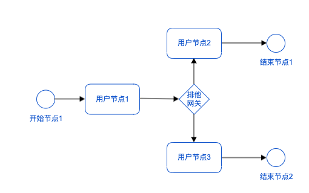
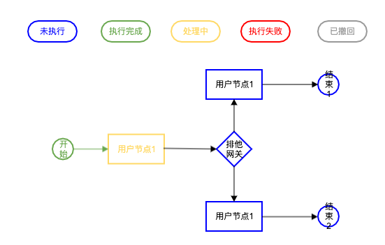
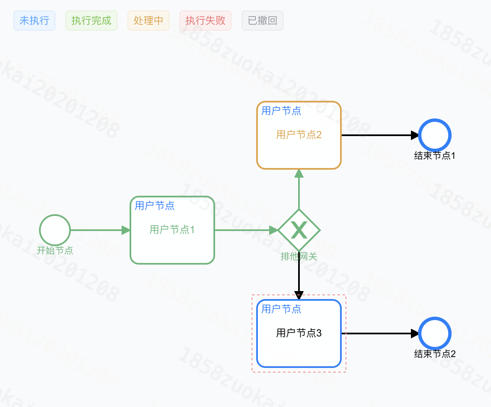
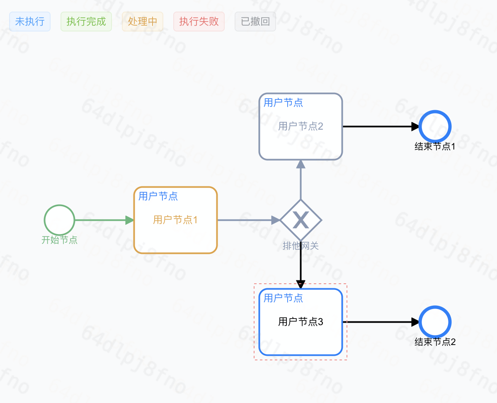
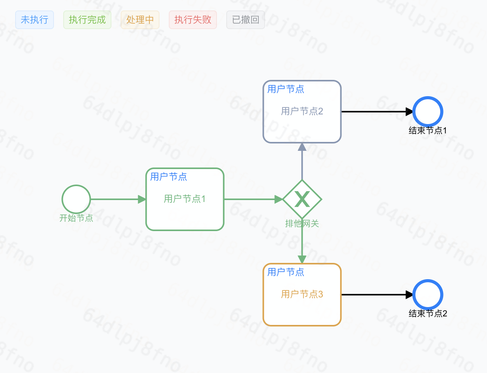
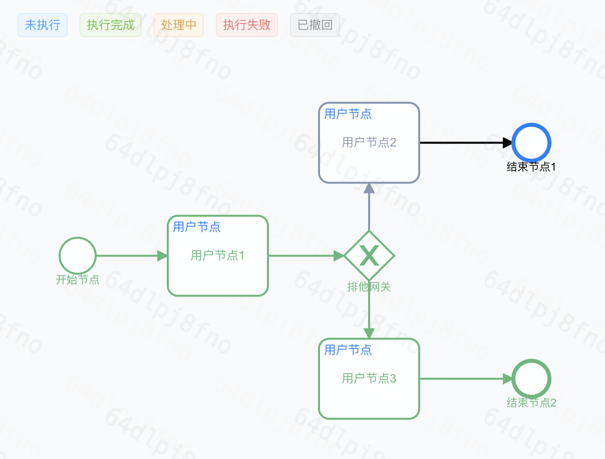

# Turbo 简介

Turbo是Didi公司开发的轻量级的Java实现的流程引擎

#

# 特性

1. 提供“定义流程，并根据流程定义，执行流程”的核心能力

2. 轻量级的库表操作

3. 支持流程回滚操作

4. 灵活支持定制化需求

#

# 关键模型

1.流程 (Flow)

宏观定义：流程是一种或一组活动，这些活动利用一个或多个输入要素，对其进行转换并使其增值，向“顾客”提供一种或多种产出。——《运营管理——流程与价值链》第7版。

本文定义：(泛指)定义了起点、终点以及起点到终点需要执行的活动、执行路径、执行策略；

2.流程实例 (FlowInstance)

一个流程可能会被多次执行，比如同一个场景的审批流是一个流程，每次有人提交审批这个流程都会被执行一次。流程每执行一次，对应一个流程实例。

3.流程元素 (FlowElement)

*考虑兼容性问题，流程元素设计参考了BPMN规范。

构成流程中的各种元素通称为流程元素（FlowElement），包括节点（FlowNode）和顺序流（SequenceFlow）

3.1 节点 (FlowNode)

3.1.1 事件节点 (EventNode)

例如：
* StartEvent：标识流程的开始；
* EndEvent：标识流程的结束；

3.1.2 活动节点 (ActivityNode)

例如：
* 任务(Task)：需要处理的节点，例如：
    * 用户任务节点(UserTask)：使用方执行任务的节点，比如需要用户提交信息；
    * 系统任务节点(ServiceTask)：系统内部自行执行任务的节点；
* 子流程(SubProcess)；将流程作为另一个流程的节点来处理；

3.1.3 网关节点(Gateway)

与SequenceFlow配合使用，用于描述SequenceFlow的执行策略，例如：ExclusiveGateway：排他网关，同一时刻的同一个实例中，根据指定输入，有且只有一条路径(SequenceFlow)被命中；

3.2 顺序流（SequenceFlow）

记录节点之间的执行顺序，可以配置执行的条件conditions（比如用户点击了“同意”作为输入），conditions只有在与网关节点Gateway配合使用时生效，由Gateway决定conditions的执行策略；

#

# 核心能力

1

2

# 快速开始

1. 引入Maven依赖

```
<dependency>
    <groupId>com.xiaoju.uemc</groupId>
    <artifactId>turbo-engine</artifactId>
    <version>1.0.0-SNAPSHOT</version>
</dependency>
```

2. 根据demo开始你的Turbo之旅吧

#

# demo介绍

demo模型



流程从开始节点开始执行，执行到用户节点1挂起并且返回



然后我们开始提交，并且传入想要流入到用户节点2的参数，这时执行到了用户节点2挂起并且返回



然后我们开始回滚，引擎会在最后一个完成的用户节点挂起，也就是用户节点1



然后我们又进行了提交，并且传入想要流入到用户节点3的参数，这时执行到了用户节点3挂起并且返回



最后，我们进行提交，最终在结束节点2完成



#

# 门户链接

www.didi.com
